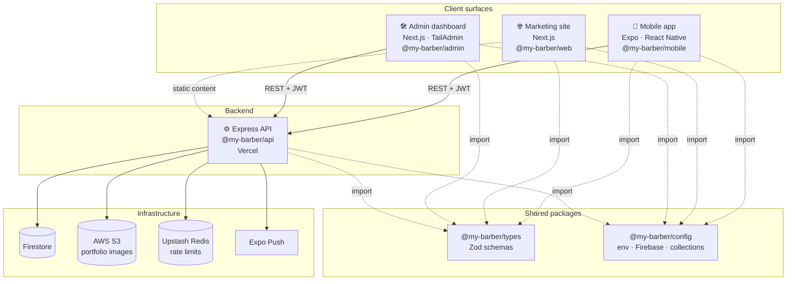

# My Barber Shop

> Barber-booking SaaS for Uzbekistan — a native mobile app for clients and barbers, a marketing site, an admin dashboard, and an Express + Firestore API, all in one pnpm + Turborepo monorepo.

<p>
  
  
  
  
  
  
  
  
</p>

---

## Table of contents

- [Overview](#overview)
- [Architecture](#architecture)
- [Tech stack](#tech-stack)
- [Repository layout](#repository-layout)
- [Prerequisites](#prerequisites)
- [Getting started](#getting-started)
- [The apps](#the-apps)
  - [Mobile — `@my-barber/mobile`](#mobile--my-barbermobile)
  - [Web — `@my-barber/web`](#web--my-barberweb)
  - [Admin — `@my-barber/admin`](#admin--my-barberadmin)
  - [API — `@my-barber/api`](#api--my-barberapi)
- [Shared packages](#shared-packages)
- [Domain model](#domain-model)
- [API surface](#api-surface)
- [Environment & configuration](#environment--configuration)
- [Scripts reference](#scripts-reference)
- [Testing](#testing)
- [CI / CD](#ci--cd)
- [Deployment](#deployment)
- [Conventions](#conventions)
- [QA test accounts](#qa-test-accounts)
- [Security](#security)
- [Troubleshooting](#troubleshooting)
- [Further reading](#further-reading)

---

## Overview

**My Barber Shop** is a two-sided marketplace that connects clients with barbers:

- **Clients** discover nearby barbers on a map, browse portfolios and services, book appointments, save favorites, review their cut history, and receive push notifications about booking status.
- **Barbers** manage a portfolio and service catalog, accept or decline bookings, track earnings, and go through an approval gate before their profile becomes publicly bookable.
- **Admins** oversee barbers, approvals, and platform data through a web dashboard.

The product is delivered across four independently deployable surfaces backed by a set of shared TypeScript packages, so the API contract, Firestore collection names, and domain types are defined **once** and reused everywhere.

---

## Architecture



**Key architectural facts** (do not assume otherwise):

- **The backend is an Express app deployed to Vercel — not Firebase Cloud Functions.** `firebase-admin` is used **only** as the Firestore SDK; there is no Functions deployment.
- **Auth is custom JWT + bcrypt.** `firebase-admin` does **not** verify Firebase Auth ID tokens. A migration to Firebase Auth is documented but **not yet executed** — see [`docs/firebase-auth-migration.md`](docs/firebase-auth-migration.md).
- **Shared types and collection names are single-sourced.** Import from `@my-barber/types` and `@my-barber/config` — never redefine a schema or hardcode a Firestore collection string.

---

## Tech stack

| Surface    | Framework                                 | Notable libraries                                                                                                                                                                                                                                                                                |
| ---------- | ----------------------------------------- | ------------------------------------------------------------------------------------------------------------------------------------------------------------------------------------------------------------------------------------------------------------------------------------------------ |
| **Mobile** | Expo SDK 54 · React Native · React 19     | expo-router (file-based routing), Shopify Restyle (theming), TanStack Query, axios, i18next + expo-localization, expo-yandex-mapkit, expo-notifications, expo-secure-store, `@gorhom/bottom-sheet`, expo-image / image-picker / image-manipulator                                                |
| **Web**    | Next.js 16 · React 19 · Tailwind CSS v4   | Landing, privacy, and terms pages                                                                                                                                                                                                                                                                |
| **Admin**  | Next.js · React 19 · Tailwind (TailAdmin) | FullCalendar, ApexCharts, `@react-jvectormap`, react-dnd, flatpickr, swiper                                                                                                                                                                                                                      |
| **API**    | Express · TypeScript                      | firebase-admin (Firestore), jsonwebtoken + bcryptjs (auth), AWS S3 (`@aws-sdk`), Upstash Redis + rate-limit-redis, express-validator + joi, helmet, compression, sharp (image compression), expo-server-sdk (push), prom-client (metrics), winston (logging), swagger-jsdoc + swagger-ui-express |
| **Shared** | TypeScript · Zod                          | Domain schemas, env loader, Firebase Admin init, Firestore collection registry, app constants                                                                                                                                                                                                    |

**Cross-cutting tooling:** pnpm (hoisted linker) · Turborepo · Prettier · ESLint (shared presets) · React `19.2.0` pinned via root `pnpm.overrides`.

---

## Repository layout

```
my-barber/
├── apps/
│   ├── mobile/     @my-barber/mobile   Expo app (clients + barbers)
│   ├── web/        @my-barber/web      Next.js marketing site
│   └── admin/      @my-barber/admin    Next.js admin dashboard (:3001)
├── backend/
│   └── api/        @my-barber/api      Express + Firestore API (Vercel)
├── packages/
│   ├── types/      @my-barber/types          Zod schemas + inferred TS types
│   ├── config/     @my-barber/config         env loader, Firebase admin, collections, constants
│   ├── tsconfig/   @my-barber/tsconfig       base / node / nextjs / react-native TS configs
│   ├── eslint-config/ @my-barber/eslint-config  base / next / expo / node ESLint presets
│   └── ui/         @my-barber/ui             shared UI (Open Design MCP output destination)
├── docs/                                  cross-cutting docs (e.g. Firebase Auth migration)
├── .github/workflows/                     CI (ci.yml) + mobile EAS build (mobile-eas.yml)
├── turbo.json                             Turborepo task graph
├── pnpm-workspace.yaml                    workspace globs + hoisted linker
└── CLAUDE.md                              monorepo conventions (agent + human guide)
```

Workspace globs (`pnpm-workspace.yaml`): `apps/*`, `packages/*`, `backend/*`.

---

## Prerequisites

| Tool                       | Version                | Notes                                                                                            |
| -------------------------- | ---------------------- | ------------------------------------------------------------------------------------------------ |
| **Node.js**                | `20.x`                 | pinned in `.nvmrc`; run `nvm use`                                                                |
| **pnpm**                   | `10.33.2`              | the **only** supported package manager (pinned via `packageManager`). Never use `npm` or `yarn`. |
| **Xcode / Android Studio** | latest                 | only for building the mobile app on a simulator/device                                           |
| **EAS CLI**                | via `pnpm dlx eas-cli` | only for mobile cloud builds                                                                     |

> **Why hoisted?** `.npmrc` and `pnpm-workspace.yaml` both set `nodeLinker: hoisted`. This is required for Expo Metro to resolve symlinked workspace packages. Do **not** switch back to `isolated` without re-testing the mobile app end to end.

---

## Getting started

```bash
# 1. Use the pinned Node version
nvm use            # reads .nvmrc → Node 20

# 2. Install all workspaces (frozen lockfile mirrors CI)
pnpm install --frozen-lockfile

# 3. Verify the whole repo builds
pnpm turbo run typecheck lint build
```

Run a single app in dev:

```bash
pnpm --filter=@my-barber/mobile dev   # Expo dev server on :8081
pnpm --filter=@my-barber/web dev      # Next.js on :3000
pnpm --filter=@my-barber/admin dev    # Next.js on :3001
pnpm --filter=@my-barber/api dev      # Express on :8080
```

> `--filter` accepts the full package name (`@my-barber/<app>`). Turbo automatically builds a package's workspace dependencies (`@my-barber/types`, `@my-barber/config`) first.

---

## The apps

### Mobile — `@my-barber/mobile`

An Expo (SDK 54) app serving **both** clients and barbers, using file-based routing via **expo-router** and an atomic-design component structure.

- **Routing** (`app/`): auth flow `(auth)/{login,otp,signup,signup-password}`, client tabs `(tabs)/{index,search,bookings,profile}`, barber area `(barber)/{settings,portfolio-edit,pending,bookings-history}`, plus standalone screens (`barber/[id]`, `barbers-map`, `location-picker`, `saved-barbers`, `cuts-history`, `notifications`, `onboarding`, `select-role`, `language`, `appearance`, `forgot-password`, `settings`, `profile-edit`).
- **Source** (`src/`): `atoms` · `molecules` · `organisms` · `templates` · `screens` · `hooks` · `navigation` · `lib` · `locales` (i18n).
- **Theming** via Shopify Restyle; **maps** via `expo-yandex-mapkit`; **data** via TanStack Query + axios; **i18n** via i18next + expo-localization.

```bash
pnpm --filter=@my-barber/mobile dev        # start Metro / Expo
pnpm --filter=@my-barber/mobile ios        # run on iOS simulator
pnpm --filter=@my-barber/mobile android    # run on Android emulator
```

Build config lives in `apps/mobile/app.config.ts`, `app.json`, and `eas.json`.

### Web — `@my-barber/web`

Next.js 16 + Tailwind v4 marketing site (landing, privacy, terms).

```bash
pnpm --filter=@my-barber/web dev     # :3000
pnpm --filter=@my-barber/web build
```

### Admin — `@my-barber/admin`

TailAdmin-based Next.js dashboard for platform operators. Ships calendar (FullCalendar), charts (ApexCharts), maps (jVectorMap), and drag-and-drop widgets.

```bash
pnpm --filter=@my-barber/admin dev   # :3001
pnpm --filter=@my-barber/admin build
```

> Template attribution: [TailAdmin free-nextjs-admin-dashboard](https://github.com/TailAdmin/free-nextjs-admin-dashboard) (MIT) — see `apps/admin/ATTRIBUTION.md`.

### API — `@my-barber/api`

Express + TypeScript API backed by Firestore, deployed to Vercel.

- **Auth:** custom JWT access tokens + refresh tokens, bcrypt-hashed passwords.
- **Storage:** portfolio/profile images uploaded to AWS S3 via presigned URLs; `sharp` compresses images server-side.
- **Rate limiting:** Upstash Redis (`rate-limit-redis`) with an in-memory fallback.
- **Push:** `expo-server-sdk` for booking lifecycle notifications.
- **Observability:** `prom-client` metrics + `winston` structured logs.
- **Docs:** OpenAPI/Swagger UI generated from JSDoc annotations.

```bash
pnpm --filter=@my-barber/api dev              # :8080 (development)
pnpm --filter=@my-barber/api dev:staging      # against staging env
pnpm --filter=@my-barber/api build            # tsc build (pre-deploy)
```

Layout under `backend/api/`: `routes/` · `services/` · `models/` · `middleware/` · `config/` · `utils/` · `tests/`. Extended docs live alongside the code (`DEPLOYMENT_GUIDE.md`, `ENVIRONMENTS.md`, `FILE_UPLOAD_GUIDE.md`, `IMAGE_COMPRESSION_GUIDE.md`, `SWAGGER_IMPLEMENTATION.md`, `COMPRESSION_STRATEGY.md`).

---

## Shared packages

| Package                    | Exports                                                                                                                             | Import instead of…                                                                          |
| -------------------------- | ----------------------------------------------------------------------------------------------------------------------------------- | ------------------------------------------------------------------------------------------- |
| `@my-barber/types`         | Zod schemas + inferred types for `user`, `barber`, `barbershop`, `service`, `booking`, `slot`, `duration`, `notification`, `common` | redefining request/response shapes                                                          |
| `@my-barber/config`        | `env` loader, `getFirebaseAdmin()`, `COLLECTIONS` registry, `app-constants`                                                         | calling `initializeApp` directly, hardcoding collection names, reading `process.env` ad hoc |
| `@my-barber/tsconfig`      | `base` / `node` / `nextjs` / `react-native` presets                                                                                 | hand-written `tsconfig` compiler options                                                    |
| `@my-barber/eslint-config` | `base` / `next` / `expo` / `node` presets                                                                                           | per-app ESLint rule duplication                                                             |
| `@my-barber/ui`            | shared UI components (Open Design MCP output)                                                                                       | copying components between apps                                                             |

**Golden rules**

- New shared type or schema → add it to `packages/types`, don't inline it.
- New Firestore collection → add its name to `packages/config/src/firestore-collections.ts` and import `COLLECTIONS`.
- New env var → add it to `packages/config/src/env.ts` **and** `backend/api/.env.example`.
- Firebase Admin is initialized **only** through `getFirebaseAdmin()` in `@my-barber/config`.

---

## Domain model

Firestore collections are registered in `@my-barber/config` (`COLLECTIONS`):

| Collection       | Holds                                                  |
| ---------------- | ------------------------------------------------------ |
| `users`          | client & barber accounts                               |
| `barbers`        | barber profiles (portfolio, approval status, services) |
| `barbershops`    | shops / locations                                      |
| `services`       | offered services (name, price, duration)               |
| `bookings`       | appointments and their lifecycle state                 |
| `notifications`  | in-app / push notification records                     |
| `devices`        | registered push tokens                                 |
| `refresh_tokens` | issued JWT refresh tokens                              |

Each collection has a matching Zod schema in `@my-barber/types` (e.g. `booking.ts`, `barber.ts`, `user.ts`, `service.ts`, `slot.ts`).

---

## API surface

Route groups under `backend/api/routes/`:

| Route group                | Responsibility                                                           |
| -------------------------- | ------------------------------------------------------------------------ |
| `auth`                     | login, signup, OTP, token refresh, password reset                        |
| `client`                   | client-facing discovery, bookings, favorites, reviews                    |
| `barber`                   | barber profile, portfolio, service catalog, earnings, booking management |
| `admin`                    | administrative operations (behind `adminAuth`)                           |
| `public`                   | unauthenticated public data                                              |
| `notifications`            | notification inbox & device registration                                 |
| `trust`                    | trust/approval-related endpoints                                         |
| `system`                   | health, metrics, and system endpoints                                    |
| `openapi-mobile-contracts` | OpenAPI contract surface consumed by the mobile client                   |
| `test`                     | test-only helpers (non-production)                                       |

Middleware (`backend/api/middleware/`): `auth`, `adminAuth`, `barberApprovalGate`, `rateLimitRedis`, `upload`, `metrics`, `errorHandler`.

Interactive API docs are served via Swagger UI (see `backend/api/SWAGGER_IMPLEMENTATION.md`); a Postman collection lives at `backend/api/postman.json`.

---

## Environment & configuration

Each app reads its env file from **its own directory** — the repo root never holds secrets.

```bash
# API
cp backend/api/.env.example backend/api/.env
# then fill in real values

# Web / Admin (as variables are added)
# apps/web/.env.local
# apps/admin/.env.local
```

- `.env.example` files are **committed** and list every variable.
- Real env files (`.env`, `.env.development`, `.env.staging`, `.env.production`, `.env*.local`) are **gitignored and must never be committed.**

> ⚠️ **2026-05-14 secret incident:** real keys (Firebase service account, JWT secret, AWS S3, Expo push token) were committed in the upstream `KAMRONBEK/my-barber-api` repo. Treat those keys as **public** — they must be rotated in every provider.

---

## Scripts reference

Root scripts (delegate to Turbo across all workspaces):

| Command             | What it does                                            |
| ------------------- | ------------------------------------------------------- |
| `pnpm build`        | `turbo run build`                                       |
| `pnpm dev`          | `turbo run dev` (persistent, uncached)                  |
| `pnpm lint`         | `turbo run lint`                                        |
| `pnpm typecheck`    | `turbo run typecheck`                                   |
| `pnpm test`         | `turbo run test`                                        |
| `pnpm clean`        | `turbo run clean` + removes `node_modules` and `.turbo` |
| `pnpm format`       | Prettier write across `**/*.{ts,tsx,js,jsx,json,md}`    |
| `pnpm format:check` | Prettier check (no writes)                              |

Turbo task graph (`turbo.json`): `build`, `lint`, `typecheck`, and `test` all depend on upstream `^build`; `dev` is persistent + uncached; build outputs cover `.next/**`, `dist/**`, `.expo/**`, `build/**`.

Scope any task to one workspace with `--filter`:

```bash
pnpm turbo run test --filter=@my-barber/api
pnpm turbo run build --filter=@my-barber/web
```

---

## Testing

- **API:** Jest (`backend/api/jest.config.cjs`, `jest.setup.ts`, tests in `backend/api/tests/`).
- **Mobile:** Jest via `apps/mobile/tests/` and `src/__tests__/`.
- Run everything: `pnpm turbo run test` — or a single package with `--filter`.

CI runs tests with `turbo run test --affected`, so only packages touched since the base commit are exercised.

---

## CI / CD

Two GitHub Actions workflows in `.github/workflows/`:

### `ci.yml` — lint · typecheck · test

- Triggers on pushes to `main`, all pull requests, and manual dispatch.
- Uses **`turbo --affected`** (`TURBO_SCM_BASE` / `TURBO_SCM_HEAD`) so a change scoped to one app doesn't re-run the whole repo. An unresolvable base falls back to running everything (fail-safe).
- `fetch-depth: 0` so Turbo can diff against the base commit; concurrency cancels superseded runs.
- Installs with `pnpm install --frozen-lockfile` on Node 20 + pnpm 10.33.2.

### `mobile-eas.yml` — mobile cloud build

- Triggers on tags matching `mobile-v*` or manual dispatch with a profile choice (`development` / `preview` / `production`).
- Runs `eas-cli build --non-interactive --no-wait` from `apps/mobile` using `EXPO_TOKEN`.

---

## Deployment

### Web / Admin / API → Vercel

Three **independent** Vercel projects, each with its root directory set to the corresponding monorepo path:

| Project | Root directory | Domains                                                          |
| ------- | -------------- | ---------------------------------------------------------------- |
| Web     | `apps/web`     | —                                                                |
| Admin   | `apps/admin`   | —                                                                |
| API     | `backend/api`  | `api.my-barber.uz` (prod) · `staging-api.my-barber.uz` (staging) |

Required GitHub Action / Vercel secrets: `VERCEL_TOKEN`, `VERCEL_ORG_ID`, and per-project `VERCEL_PROJECT_ID_WEB`, `VERCEL_PROJECT_ID_ADMIN`, `VERCEL_PROJECT_ID_API`. API deploy details live in `backend/api/DEPLOYMENT_GUIDE.md` and `backend/api/ENVIRONMENTS.md`.

### Mobile → EAS

Built via Expo Application Services, triggered by a `mobile-v*` tag or manual workflow dispatch (see `mobile-eas.yml`). Profiles configured in `apps/mobile/eas.json`.

---

## Conventions

- **Package manager:** pnpm only, pinned to `10.33.2`. Never `npm` / `yarn`.
- **Task runner:** Turbo — `pnpm turbo run <task>` for cross-package work.
- **Commits:** Conventional Commits — `feat:`, `fix:`, `chore:`, `docs:`, `refactor:`, `test:`, `ci:` (optional scope, e.g. `fix(mobile): …`). Keep monorepo-wide changes (root config, shared packages, CI) in their own commits; scope app-specific changes per app.
- **Formatting:** Prettier — semicolons, single quotes, trailing commas (`all`), print width 100, tab width 2.
- **Code style:** many small, focused files; explicit error handling; validate at boundaries; prefer immutable updates. Full guidance in [`CLAUDE.md`](CLAUDE.md).

---

## QA test accounts

Seeded in every environment (staging + production) for manual testing from the mobile app or Swagger UI:

| Role   | Username            | Password       |
| ------ | ------------------- | -------------- |
| Barber | `barber@test.local` | `DevTest12345` |
| Client | `client@test.local` | `DevTest12345` |

The barber account is pre-approved (`approvalStatus: approved`) so it's immediately bookable.

> These accounts come pre-seeded per environment. There is currently no `seed` script in the API package — seeding is handled as part of environment provisioning (see `backend/api/ENVIRONMENTS.md`).

---

## Security

- No secrets in source — everything through env files / secret managers. `.env.example` is the committed contract.
- Custom JWT + bcrypt auth; rate limiting on endpoints (Upstash Redis); `helmet` security headers; input validation via `express-validator` + `joi`.
- See the [2026-05-14 secret incident](#environment--configuration) — assume the leaked upstream keys are public and rotate them.
- Firebase Admin is only ever initialized through `getFirebaseAdmin()`.

---

## Troubleshooting

| Symptom                                   | Fix                                                                                                                |
| ----------------------------------------- | ------------------------------------------------------------------------------------------------------------------ |
| Mobile Metro can't resolve `@my-barber/*` | Ensure `nodeLinker: hoisted` (root `.npmrc` + `pnpm-workspace.yaml`), then reinstall. Do not switch to `isolated`. |
| `npm`/`yarn` errors or lockfile drift     | Use pnpm only. Reinstall with `pnpm install --frozen-lockfile`.                                                    |
| Turbo runs more than expected in CI       | CI uses `--affected`; locally you can too: `pnpm turbo run <task> --affected`.                                     |
| Wrong Node version                        | `nvm use` (reads `.nvmrc` → Node 20).                                                                              |
| Stale build cache                         | `pnpm clean` (removes `node_modules` + `.turbo`), then reinstall.                                                  |
| API can't reach Firestore                 | Confirm `backend/api/.env` is filled from `.env.example` and the service account is valid.                         |

---

## Further reading

- [`CLAUDE.md`](CLAUDE.md) — full monorepo conventions.
- [`docs/firebase-auth-migration.md`](docs/firebase-auth-migration.md) — planned (not executed) Firebase Auth migration.
- `backend/api/*.md` — API deployment, environments, file upload, image compression, and Swagger guides.
- **Upstream references:**
  - API source: [`KAMRONBEK/my-barber-api`](https://github.com/KAMRONBEK/my-barber-api) (subtree-merged at `backend/api/` on 2026-05-14).
  - Admin template: [`TailAdmin/free-nextjs-admin-dashboard`](https://github.com/TailAdmin/free-nextjs-admin-dashboard) (MIT).
